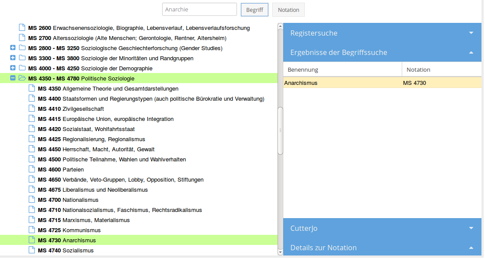
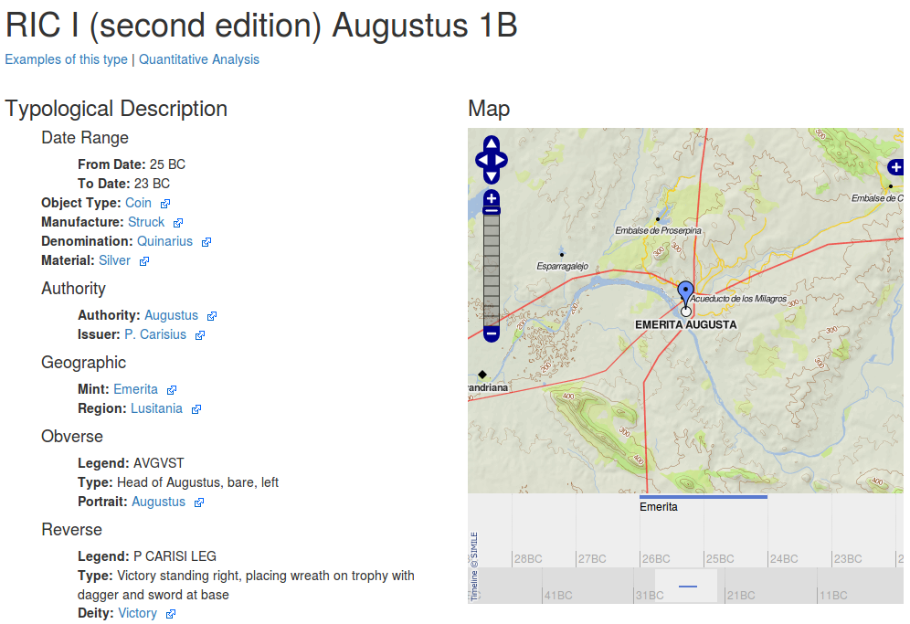

---
title: Anforderungen an Normdatendienste
author: Jakob Voß
date: 2016-04-04
place: DINI AG KIM, UB Mannheim
institute: Verbundzentrale des GBV (VZG)
...

## Begriffsklärung: Normdaten 

Normdaten
  : System aus Begriffen zur Wissensorganisation\
    **$\rightarrow$ Wissensorganisationssystem**

* Klassifikationen (RVK, DDC...)
* Thesauri (STW, Getty...)
* Normdateien (GND, VIAF...)
* ...

Verzeichnis unter <http://bartoc.org/>

## Begriffsklärung: Dienst

Dienst
  : Zugriff auf zusammenhängende Funktionalität über eine klar definierte Schnittstelle

#. **Interface** (HTML, GUI...) für Menschen
#. **API/Webservice** (JSON, XML, RDF...) für Programme

## Beispiel für Normdaten-Interface: RVK

## Beispiel für Normdaten-Interface: Mockup

## Beispiel für Normdaten-Interface: OCRE

## Anforderungen an Normdaten-Interfaces

* Usability (effektive Nutzbarkeit für ein **Ziel**)\
  $\Rightarrow$ Anwendungsfall ist ein konkretes Ziel,\
   z.B. *passenden Begriff finden*

## Anwendungsfall für Normdaten-Interface

> Ein Probleme oder eine Frage, die mit Hilfe eines Normdatendienst gelöst werden kann.

------------------------- --------
Name                      ...
Ziel                      ...
Aktionen                  ...
Mockup, API-Funktionen... ...
------------------------- --------

## Gruppen von Anwendungsfällen

Allgemein

* *Zugriff auf...*
* *Suche nach...*
* *Bearbeitung von...*
* ...

Konkret

* *Häufigste Begriffe bei der Indexierung?*
* ...

## Von Normdaten-Interfaces zu Normdaten-APIs

* Usability (effektive Nutzbarkeit für ein Ziel)\
  $\Rightarrow$ Anwendungsfall ist ein konkretes Ziel,\
   z.B. *passenden Begriff finden*

* Funktionalität **basiert auf Normdaten-API**\
  $\Rightarrow$ Anforderungen an Normdaten-API,\
  z.B. *nach Begriffen suchen*, *Begriff-Details abfragen*...

## Beispiele für Normdaten-APIs

* [lobid-API (hbz)](https://lobid.org/api)
* [Web Services for Economics (ZBW)](http://zbw.eu/en/project/econ-ws)
* [Entity Facts (DNB)](http://www.dnb.de/entityfacts)
* [finto: Finnish thesaurus and ontology service](https://finto.fi/en/)
* [Library of Congress Linked Data Service](http://id.loc.gov/)
* [Spatial Information Services Stack Vocabulary Service](http://www.sissvoc.info/)
* [Neuroscience Information Framework Vocabulary Server](http://www.bodc.ac.uk/products/web_services/vocab/)
* [Australian National Data Service Vocabularies API](http://ands.org.au/) 
* ...

**Anfrage** (Parameter, Optionen, Felder...)\
$\Longrightarrow$ **Antwort** (Objekte, Eigenschaften, Felder, ...)

## Anwendungsfall für Normdaten-Interface

> Ein Probleme oder eine Frage, die mit Hilfe eines Normdatendienst gelöst werden kann.

---------------------------- ----------
Name                         ...
Ziel                         ...
(Bestandteile der) Anfrage   ...
(Bestandteile des) Ergebnis  ...
---------------------------- ----------

# Weiterer Verlauf der Session

## Erste Runde: Anwendungsfälle finden

Jede(r) erstellt für sich Liste von Anwendungsfällen

* *Abfrage von synonymen Benennungen zu einem Begriff*
* *Passende Normdatei finden*
* *Neuen Begriff vorschlagen*
* ... 

**5 Minuten Zeit**

## Zweite Runde

* Vorstellung der Listen in Kleingruppen (keine Diskussion!)
* Einordnung: Interface / API / beides

**5 Minuten Zeit**

## Dritte Runde

...

# Beispiele für Anwendungsfälle

## Vorhandene Anwendungsfälle

* Passende Normdatei finden
* Begriff anzeigen
* Metadaten über Begriff (Erstellungsdatum, Status, Autoren...) nachschlagen
* Begriff markieren oder kommentieren
* Neuen Begriff vorschlagen
* Passenden Begriff in einer Normdatei finden
* Verwandte Begriffe zu einem gegebenen Begriff finden
* Dokument mit Begriffen aus Normdatei indexieren
* Vorhandene Verwendung eines Begriffs ermitteln
* Mapping eines Begriffs auf andere Normdateien ermitteln
* ...

